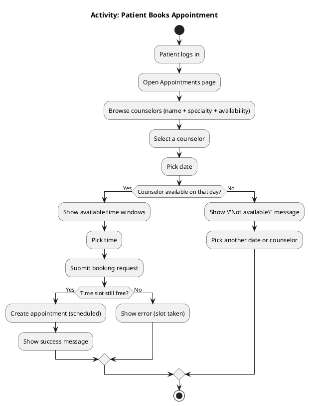
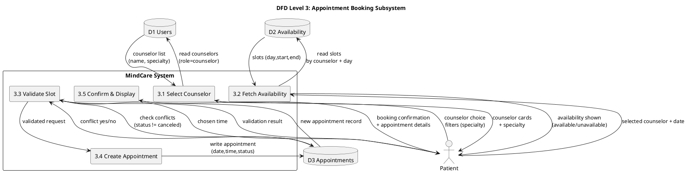
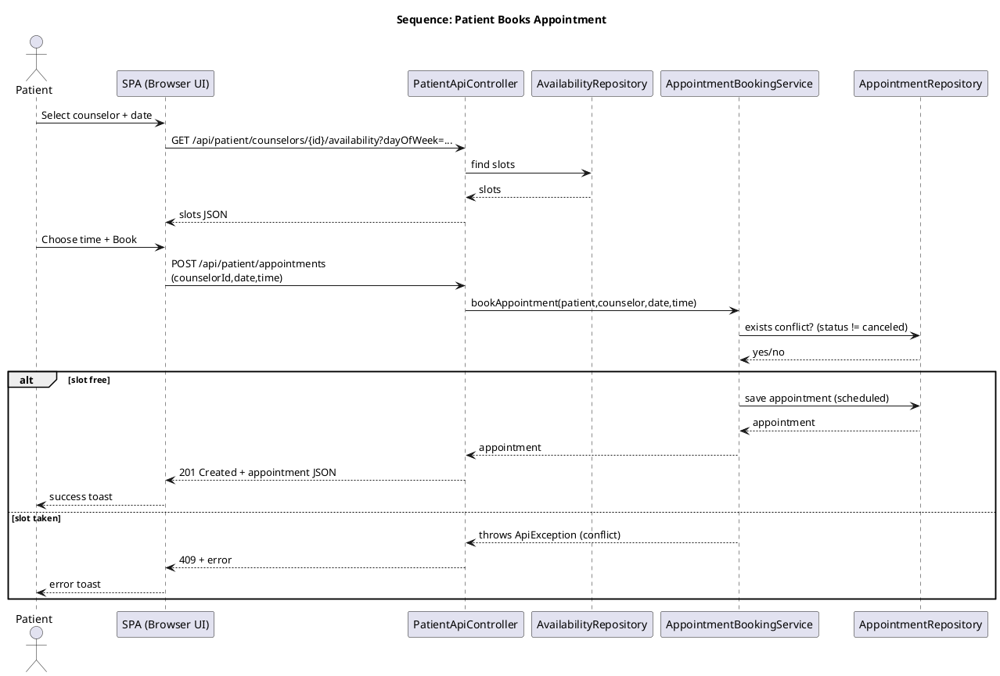

# MindCare (MindCare Mini) — Mental Health Support Platform

MindCare is a role-based mental health support web app built with **Spring Boot (Java)** and a **vanilla JS single-page UI**.  
It supports **Patients**, **Counselors**, and **Admins** with workflows for mood tracking, availability management, appointment booking, and user administration.

---

## Key roles & what they can do

### Patient
- **Mood Tracker**: log daily mood (rating + optional notes), view history/trends.
- **Find Counselors**: browse counselors with **specialty** + **weekly availability** indicators.
- **Appointments**: check availability by date, book appointment, view/cancel appointments.

### Counselor
- **Availability**: define weekly availability slots (day of week + start/end time).
- **My Patients**: see patients assigned to them **and** patients who booked them.
- **Patient Mood View**: view mood history of patients who are assigned or booked with them.
- **Appointments**: view upcoming appointments and update appointment status.

### Admin
- **User Management**:
  - Create counselors/admins
  - **Edit user details** (name/email/specialty) **but not roles**
  - Activate/deactivate users
  - Delete users (with confirmation; cascade cleanup is handled server-side)

---

## Tech stack

### Backend
- Java 17, Spring Boot
- Spring Web (REST controllers)
- Spring Data JPA + Hibernate
- PostgreSQL (recommended) / H2 (tests)

### Frontend
- Static SPA in `src/main/resources/static/`
- Vanilla JS modules + hash router
- Modern CSS (responsive, role-based navigation)

---

## Architecture (high-level)

- **Backend is REST-based** under `/api/...`
  - Controllers enforce **role authorization** via `SessionAuthService`.
  - Data is stored via JPA entities + repositories.
- **Frontend is a hash-based SPA**
  - Routes are defined in `static/js/main.js` and resolved by `static/js/router.js`.
  - API calls are made through `static/js/api.js`.
  - UI state (logged-in user) is stored in `static/js/state.js`.

### Design pattern used (explicit)
**Observer Pattern** (Frontend state management):
- `static/js/state.js` exposes `subscribe()` and `setState()`.
- UI updates (nav visibility, user badge) subscribe to state changes so pages do not tightly couple to auth logic.

---

## Project structure (important folders)

```text
src/main/java/com/example/mentalhealth/
  controller/      REST APIs (Auth, Patient, Counselor, Admin, etc.)
  model/           JPA entities (User, Patient, Appointment, MoodEntry, Availability, ...)
  repository/      Spring Data JPA repositories
  service/         Business logic (sessions, booking service)

src/main/resources/static/
  index.html        Single-page shell (navbar + footer)
  styles.css        App styling
  js/
    main.js         Route definitions + nav wiring
    api.js          Fetch wrapper
    router.js       Hash router
    state.js        Global state (Observer pattern)
    pages/          Page modules (patient/counselor/admin views)
```

---

## Configuration

Main config file: `src/main/resources/application.properties`

```properties
spring.datasource.url=jdbc:postgresql://localhost:5432/mindcaremini
spring.datasource.username=postgres
spring.datasource.password=...
spring.jpa.hibernate.ddl-auto=update
server.port=8080
```

Admin bootstrap defaults (overridable by env vars):
```properties
mindcare.admin.email=admin@mindcare.local
mindcare.admin.password=admin123
mindcare.admin.name=Default Admin
```

---

## How to run (local)

### 1) Start PostgreSQL (recommended)
Create a database (example):
- DB: `mindcaremini`
- User: `postgres`
- Password: set in `application.properties` (or env vars)

### 2) Run the app

On Windows (PowerShell):
```powershell
.\mvnw.cmd spring-boot:run
```

Then open:
- `http://localhost:8080`

---

## Common API routes (overview)

### Auth
- `GET /api/auth/me` — current session user
- `POST /api/auth/login` — login
- `POST /api/auth/logout` — logout

### Patient
- `GET /api/patient/counselors`
- `GET /api/patient/counselors/{id}/availability`
- `GET/POST /api/patient/mood`
- `GET/POST /api/patient/appointments`

### Counselor
- `GET /api/counselor/patients`
- `GET /api/counselor/patients/{patientId}/mood`
- `GET/PUT /api/counselor/availability`
- `GET /api/counselor/appointments`

### Admin
- `GET /api/admin/users`
- `PUT /api/admin/users/{id}` — edit name/email/specialty (role is not editable)
- `POST /api/admin/users/{id}/active` — activate/deactivate
- `DELETE /api/admin/users/{id}`

---

## UML / Diagram codes (simple)

You can paste these into:
- **PlantUML** (recommended): `https://plantuml.com/`
- Or **Mermaid** if your renderer supports it.

### 1) Activity Diagram (Patient books an appointment) — PlantUML



### 2) Data Flow Diagram (DFD) — Level 3 (Appointment Booking) — PlantUML

This “Level 3” DFD focuses on the **Appointment Booking** subsystem and decomposes it into smaller steps.



### 3) Sequence Diagram (Patient books appointment) — PlantUML



---

## Notes
- If you change frontend files, the source of truth is `src/main/resources/static/...`.
- In some IDE/run setups, you may need to re-run the build or restart the app for static resources to refresh.


